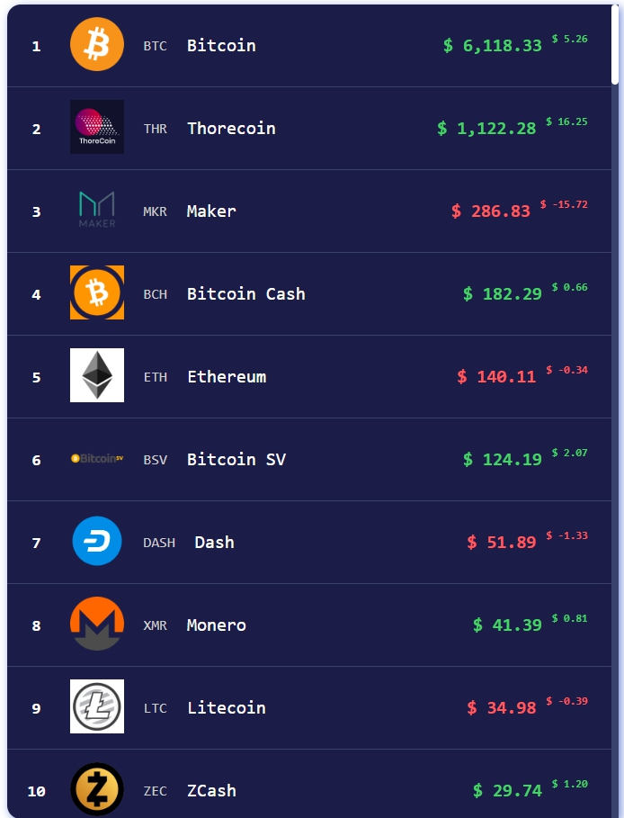

# vue-crypto



Vue.js

Automaticaly updated crypto currencies list with inifite scroll

## Environment

`Node >= 6`

## Develop

``` bash
# serve with hot reload at localhost:8010
npm i
npm run dev
```

## Build

``` bash
# build for production with minification
npm i
npm run build
```
